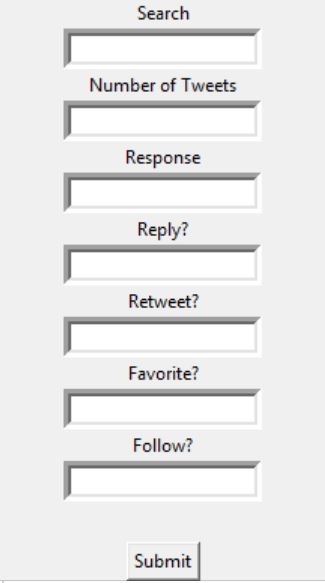

# TwitterBot

Given a specified Twitter account, this bot follows back all of its followers, and displays a GUI application using Tkinter

In this application you can:

* Search for keywords on twitter
* Respond to tweets
* Favorite tweets
* Retweet the tweet 
* Follow the user that tweeted
* Select how many tweets you would like to interact with 
    
Simply input "yes" or "no" for the boxes under retweeting, responding, favoriting, following and input any integer for the tweets that you want to interact with.
